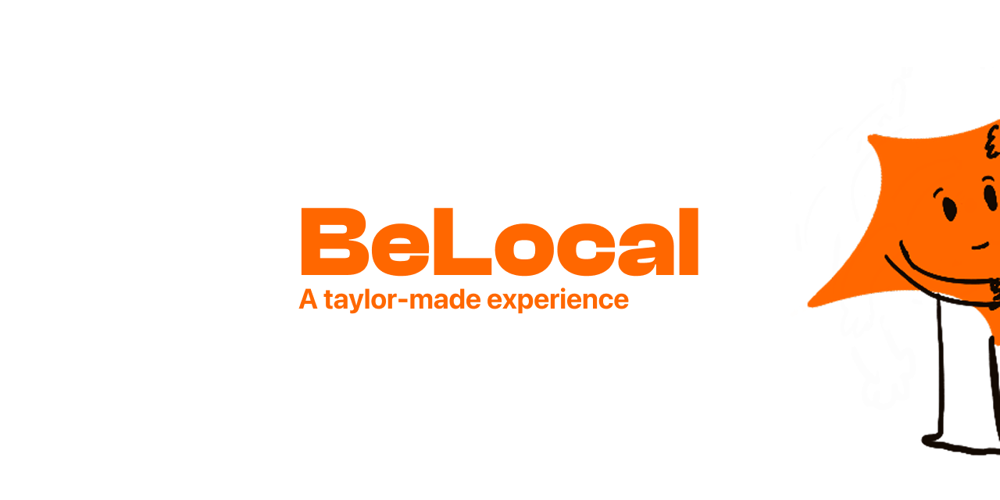

<div align="center">
  
  <h1>BeLocal</h1>
  <p>
    <strong>BeLocal</strong> is an iOS travel app that turns preferences, local perspective, and AI planning
    into more personal destination discovery.
  </p>
  <p>
    Built with SwiftUI, CoreML, Apple Foundation Models, Supabase, and the OpenAI Responses API.
  </p>
  <p>
    
    
    
    
  </p>
</div>

<p align="center">
  <a href="#overview">Overview</a> •
  <a href="#why-belocal">Why BeLocal</a> •
  <a href="#features">Features</a> •
  <a href="#team">Team</a> •
  <a href="#tech-stack">Tech Stack</a> •
  <a href="#getting-started">Getting Started</a>
</p>

---

## Overview

BeLocal is the public repository for an iOS product designed to make travel recommendations feel more human, contextual, and useful.

Instead of showing the same generic destinations to everyone, BeLocal combines:

- personal travel preferences
- budget and seasonal fit
- sustainability signals
- local and traveler feedback
- conversational AI planning

The result is a travel experience that helps users discover where to go, why it fits them, and how to start shaping the trip.

## Why BeLocal

Travel apps often optimize for popularity, not relevance. BeLocal takes a different approach:

- It starts from the traveler profile, not from a global ranking.
- It explains why a destination is recommended instead of hiding the logic.
- It values local perspective and sustainability alongside price and style.
- It connects inspiration, exploration, and planning inside one app.

## Features

### Personalized recommendations

- Onboarding creates a travel profile based on budget, preferred seasons, travel style, and sustainability sensitivity.
- A recommendation engine blends CoreML scoring, explicit user preferences, and explainability.
- Each destination surfaces contextual reasoning, match strength, and estimated CO2 impact.

### City exploration

- Interactive map-based city discovery powered by MapKit.
- Attraction and city information enriched by external travel services.
- Feedback from travelers and locals adds a more grounded view of each destination.

### AI planner

- Conversational trip planning through a dedicated planner flow.
- Saved planner conversations and final travel briefs.
- Hybrid AI strategy using Apple Foundation Models where available and OpenAI-backed services when needed.

### Offline-aware experience

- Local-first persistence with SwiftData.
- Sync queue and online/offline awareness through Supabase and network monitoring.
- Graceful fallbacks when live services are unavailable.

## Apple Foundation Program

BeLocal is being developed as part of the **Apple Foundation Program**, where the project is shaped as both a product concept and a production-minded iOS implementation.

This repository is meant to show:

- product thinking
- SwiftUI and iOS engineering quality
- experimentation with AI-powered user experiences
- iterative design informed by real traveler needs

## Team

This project is presented by the **Apollo Team** for the **Apple Foundation Program**.

<table>
  <tr>
    <td><strong>Project</strong></td>
    <td>BeLocal</td>
  </tr>
  <tr>
    <td><strong>Team</strong></td>
    <td>Apollo Team</td>
  </tr>
  <tr>
    <td><strong>Context</strong></td>
    <td>Apple Foundation Program</td>
  </tr>
  <tr>
    <td><strong>Focus</strong></td>
    <td>Travel discovery, local insight, and AI-assisted trip planning</td>
  </tr>
  <tr>
    <td><strong>Audience</strong></td>
    <td>Young adults who want a more authentic and personalized travel experience</td>
  </tr>
</table>

### Participants

<table>
  <tr>
    <td>Maria Bianco</td>
    <td>Sila Farasat</td>
  </tr>
  <tr>
    <td>Vincenzo Maritato</td>
    <td>Alessandra Imperatore</td>
  </tr>
  <tr>
    <td>Antonio Rigione</td>
    <td>Alessandro Signorile</td>
  </tr>
  <tr>
    <td>Ylenia Villani</td>
    <td></td>
  </tr>
</table>

## Project Vision

Based on the project material, BeLocal is designed to help travelers build a more personal trip with:

- recommendations filtered around their preferences
- local suggestions and community feedback
- AI support for tailor-made itineraries
- exploration tools that make planning less generic and more authentic

## Product Highlights

- **Recommendation engine** with explainable ranking and profile-driven scoring
- **Planner Studio** with chat-based trip generation and saved briefs
- **City Explorer** with interactive map browsing and live enrichment
- **Multilingual support** through localized strings and translated feedback flows
- **Architecture ready for real services** with Supabase sync and external travel APIs

## Tech Stack

<table>
  <tr>
    <td><strong>Client</strong></td>
    <td>Swift, SwiftUI, SwiftData</td>
  </tr>
  <tr>
    <td><strong>Apple technologies</strong></td>
    <td>CoreML, MapKit, Foundation Models</td>
  </tr>
  <tr>
    <td><strong>Backend services</strong></td>
    <td>Supabase Auth and REST</td>
  </tr>
  <tr>
    <td><strong>AI services</strong></td>
    <td>OpenAI Responses API</td>
  </tr>
  <tr>
    <td><strong>Travel data</strong></td>
    <td>Google Places API, Geoapify</td>
  </tr>
</table>

## Repository Structure

```text
Waypoint/
├── Waypoint/                  # App source, models, services, resources, and views
├── Waypoint.xcodeproj/        # Xcode project
├── .github/                   # Issue and pull request templates
├── docs/                      # Public setup and project notes
├── README.md
├── CONTRIBUTING.md
├── CODE_OF_CONDUCT.md
├── SECURITY.md
└── LICENSE
```

## Getting Started

### Prerequisites

- macOS with the full Xcode app installed
- Xcode 26.3 or newer recommended
- iOS Simulator or a physical device
- Optional accounts for Supabase, OpenAI, Google Places, and Geoapify

### Local setup

1. Open [`Waypoint.xcodeproj`](Waypoint.xcodeproj) in Xcode.
2. Fill the placeholder values in:
   - [`Waypoint/Resources/SupabaseConfig.plist`](Waypoint/Resources/SupabaseConfig.plist)
   - [`Waypoint/Resources/TravelAPIConfig.plist`](Waypoint/Resources/TravelAPIConfig.plist)
3. Or configure runtime variables through your Xcode scheme as documented in [`docs/setup.md`](docs/setup.md).
4. Run the `Waypoint` target.

## Public Repository Notes

- Committed configuration files contain placeholder values only.
- User-specific Xcode data and local build artifacts are ignored.
- If secrets were committed in local history before publication, rotate them before pushing the repository publicly.

## Contributing

Please read [`CONTRIBUTING.md`](CONTRIBUTING.md) before opening a pull request.

## Security

If you discover a vulnerability or an exposed credential, follow [`SECURITY.md`](SECURITY.md).

## License

This project is released under the MIT License. See [`LICENSE`](LICENSE).

---

<div align="center">
  <sub>
    Built with SwiftUI, curiosity, and an unreasonable number of imaginary weekend trips.
  </sub>
</div>
